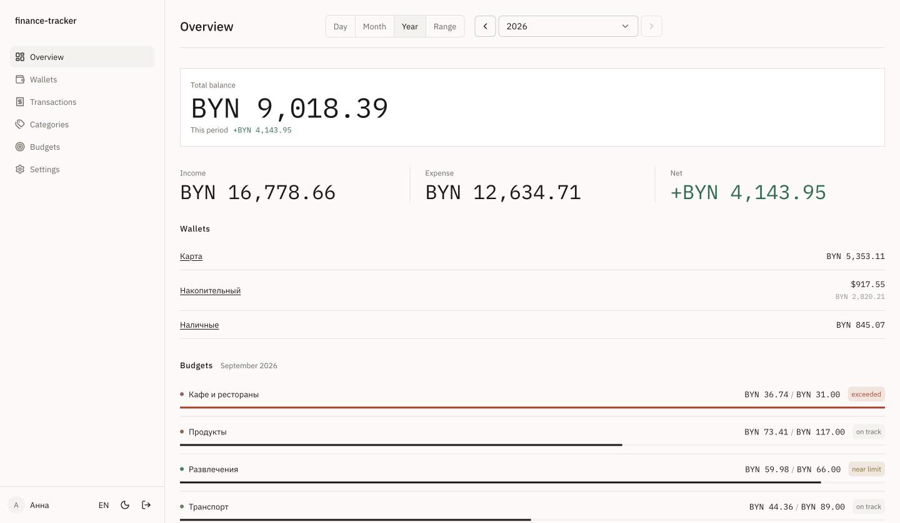
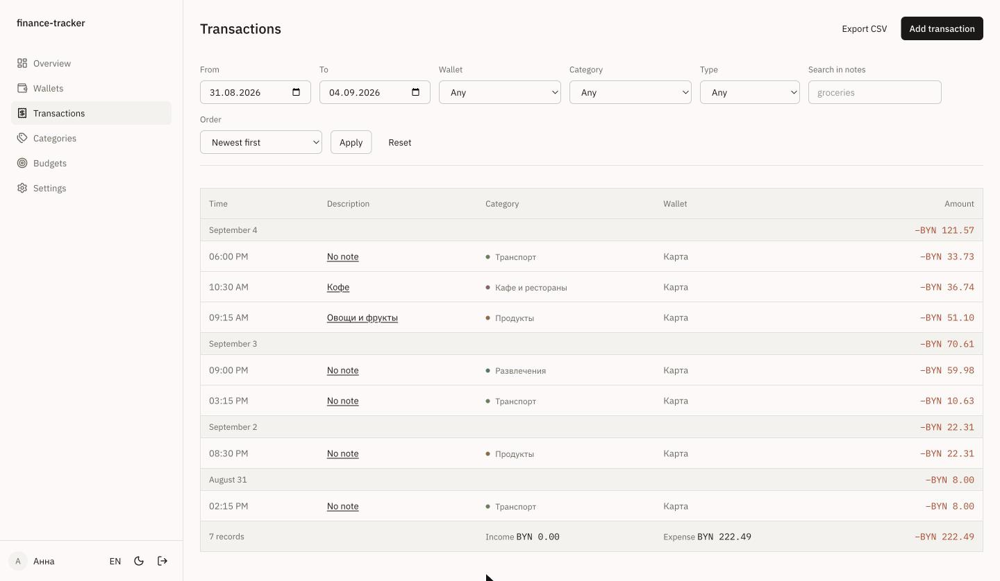
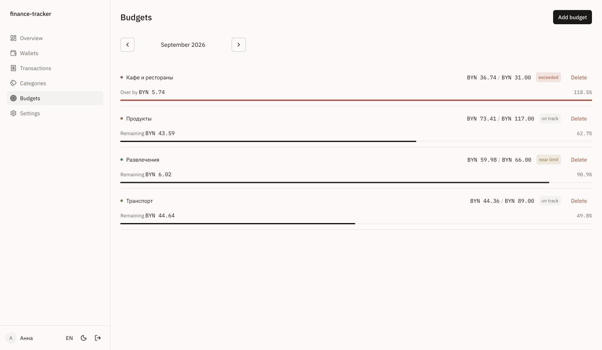
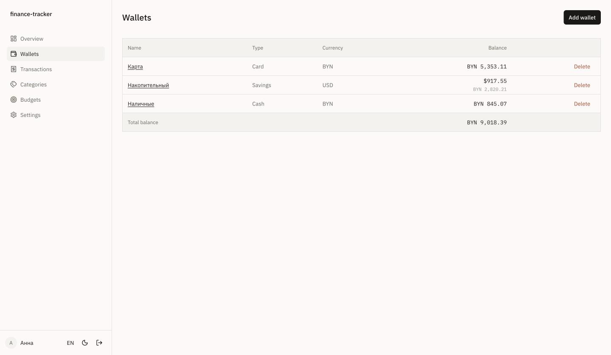
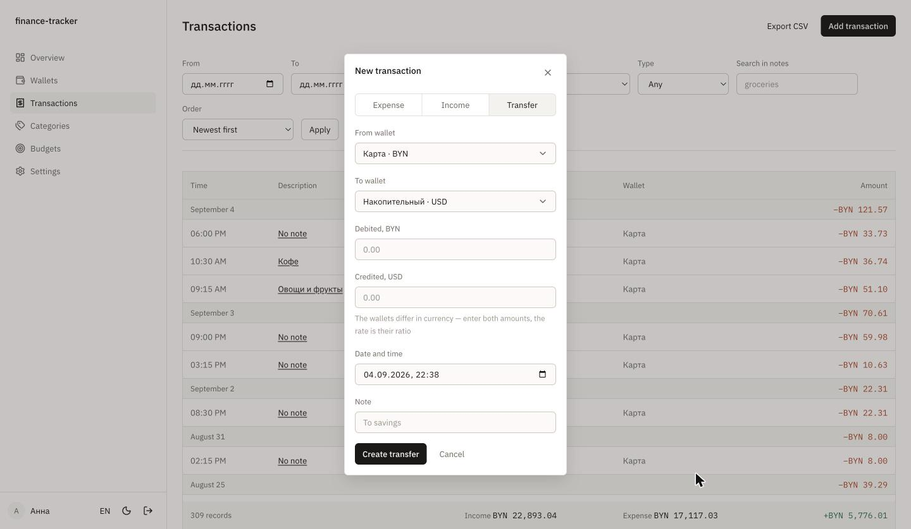
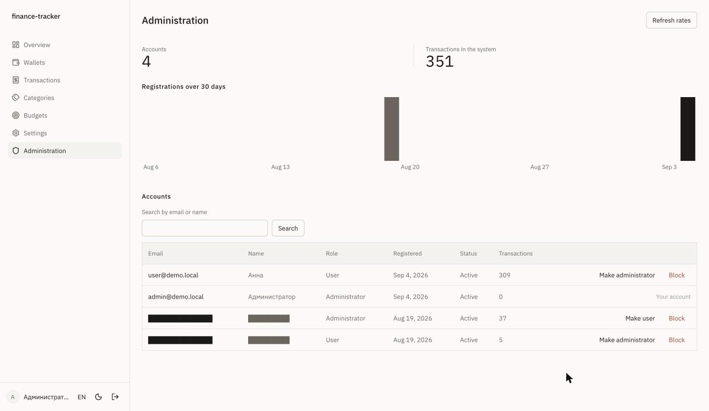

# finance-tracker

A personal finance web application. A user keeps several accounts in different
currencies, records income and expenses, sorts them into categories, sets
monthly spending limits and reads the totals back in a single reporting
currency.

Built as a practice project for BSUIR. The requirements, the data model and
the REST contract were written before the code and live in [`docs/`](docs).

## Demo

The application is deployed on Vercel with a Neon database: https://finance-tracker-lyart-chi.vercel.app/

Two seeded accounts are open:

| Account | Email              | Password            |
| ------- | ------------------ | ------------------- |
| User    | `user@demo.local`  | `demo-tracker-2026` |
| Admin   | `admin@demo.local` | `demo-tracker-2026` |

The demo database is filled by `pnpm db:seed`: two accounts, three wallets,
twelve months of transactions, transfers, budgets and exchange rates. The
generator is deterministic — the same run produces the same data.

## Screenshots

|                                                                                                 |                                                                                       |
| ----------------------------------------------------------------------------------------------- | ------------------------------------------------------------------------------------- |
|                                                     |                                     |
| **Dashboard** — total balance, income, expense and net for the period, wallets, budget progress | **Transactions** — filters kept in the URL, totals for the current filter, CSV export |
|                                                         |                                               |
| **Budgets** — limit, spent, remaining and share of the limit per category                       | **Wallets** — balance in the wallet's own currency and in the reporting currency      |
|                                                       |                                                   |
| **Transfer** — a dialog on an intercepted route; across currencies both amounts are entered     | **Admin** — accounts, roles, blocking, system statistics                              |

Taken against the seeded database in the English locale; wallet and category
names come from the seed and stay Russian. Two rows in the admin screenshot are
non-demo accounts and their email and name are masked.

## Features

- **Accounts and access.** Registration and sign-in with email and password,
  bcrypt hashes, JWT sessions, rate limiting on both entry points, blocking of
  an account from the admin panel, `USER` and `ADMIN` roles.
- **Wallets.** Cash, card and savings accounts in BYN, USD or EUR. The balance
  is always computed from the initial balance and the transactions — it is
  never stored denormalised.
- **Transactions.** Income and expense with an amount, wallet, category, date
  and note; filtering by period, wallet, category and type; case-insensitive
  search over notes; pagination; CSV export of the filtered list.
- **Transfers.** A transfer is two linked rows written in one database
  transaction. Across currencies the user enters both amounts and the
  effective rate is stored with them.
- **Budgets.** A monthly limit per expense category, with spent amount,
  remainder and share of the limit, and a visual mark once it is exceeded.
- **Multi-currency.** Rates come from the open API of the National Bank of the
  Republic of Belarus and are stored per date. A transaction keeps the rate,
  the converted amount and the rate date it was created with; historical
  amounts are never recomputed at today's rate.
- **Analytics.** Total balance, income and expense and net result for a period,
  expenses by category, six-month dynamics, recent transactions.
- **REST API.** The whole CRUD surface under `/api/v1`, authenticated by the
  session cookie, with a single error envelope.
- **Interface.** Russian and English, light and dark themes, dense tables,
  loading, empty and error states for every list, forms that work without
  JavaScript.

## Stack

Next.js 16 (App Router) · TypeScript in strict mode · Prisma 7 ·
PostgreSQL 16 · Auth.js v5 (credentials, JWT) · Zod · next-intl · Tailwind ·
shadcn/ui · Recharts · Vitest. The package manager is pnpm.

## Architecture

```
app/[locale]/(app)/**   UI. Server components read through services,
                        mutations go through server actions.
app/[locale]/(auth)/**  Sign-in and registration.
app/api/v1/**           REST route handlers.
lib/api/**              REST response and error mapping.
lib/services/**         All business logic. Unit tests live next to it.
lib/repositories/**     The only place that calls prisma.*
lib/schemas/**          Zod schemas shared by API, actions and forms.
lib/auth/**             Auth.js configuration, session helpers, guards.
prisma/                 schema.prisma, migrations, seed.ts
i18n/, messages/        next-intl routing and the ru/en dictionaries
proxy.ts                locale routing and unauthenticated redirects
```

## Data model

Six tables: `User`, `Wallet`, `Category`, `Transaction`, `Budget` and
`ExchangeRate`. Sessions are JWT, so there are no Auth.js adapter tables.
Referential integrity, positive amounts, the match between a transaction's
type and its category, the pairing of a transfer with its group and the
BYN-target rule for rates are all enforced by database constraints, not only
by the application.

[](docs/erd.svg)

The diagram is generated from `prisma/schema.prisma` by `prisma generate` and
committed, because the build environments have no headless browser for the
generator. Regenerate it with `DISABLE_ERD=false pnpm exec prisma generate`.

## Running it

Both ways need a `.env`. Copy the example and put a signing key in it:

```bash
cp .env.example .env
openssl rand -hex 32   # paste into AUTH_SECRET
```

### 1. Containers — application and database in one command

Requires Docker. Builds the image and starts PostgreSQL, a one-shot migration
service and the application on <http://localhost:3000>. `AUTH_SECRET` is read
from `.env`; everything else has a default.

```bash
pnpm docker:up
pnpm docker:down   # stop
```

Migrations are applied by a separate one-shot `migrate` service, and the
application waits for it to succeed — running them from the application's
start command would race across replicas. `AUTH_SECRET` has no default on
purpose: an image with a signing key baked in should not exist.

### 2. Local development — Node on the host, database in a container

```bash
pnpm install
pnpm db:up        # PostgreSQL 16 on :5432
pnpm db:migrate   # apply migrations
pnpm db:seed      # demo data, optional
pnpm dev          # http://localhost:3000
```

### Production

The public instance runs on Vercel with a Neon database. Deployment needs no
configuration of its own: Vercel builds on push and gives every pull request a
preview build. Two environment variables matter there — `DATABASE_URL`
pointing at Neon and `DISABLE_ERD=true`, because the build runs
`prisma generate` and the diagram generator wants a headless browser the build
image does not have. Exchange rates are refreshed daily at 06:00 UTC by the
cron entry in `vercel.json`.

## Environment

| Variable       | Required      | Meaning                                             |
| -------------- | ------------- | --------------------------------------------------- |
| `DATABASE_URL` | yes           | PostgreSQL connection string                        |
| `AUTH_SECRET`  | yes           | Auth.js signing key                                 |
| `AUTH_URL`     | in production | Public origin of the application                    |
| `NBRB_API_URL` | no            | National Bank rates API, defaults to the public one |
| `CRON_SECRET`  | no            | Bearer token guarding `/api/cron/rates`             |
| `DISABLE_ERD`  | no            | `true` skips ER diagram generation during the build |

Secrets stay in `.env`, which is not committed.

## Scripts

```bash
pnpm dev              # development server
pnpm lint             # eslint + tsc --noEmit
pnpm test             # vitest
pnpm db:up            # start the database container
pnpm db:migrate       # prisma migrate dev
pnpm db:seed          # demo data
pnpm db:studio        # prisma studio
pnpm rates:refresh    # pull fresh rates from the National Bank
pnpm docker:up        # application and database in containers
pnpm docker:down      # stop them
```

## Testing

Services are unit-tested against mocked repositories, so the suite needs no
database. Balance calculation, category aggregation, budget usage, currency
conversion and rounding, transfer invariants and ownership checks are covered
by requirement. GitHub Actions runs type checking, lint and the tests on every
pull request.

```bash
pnpm test
```
