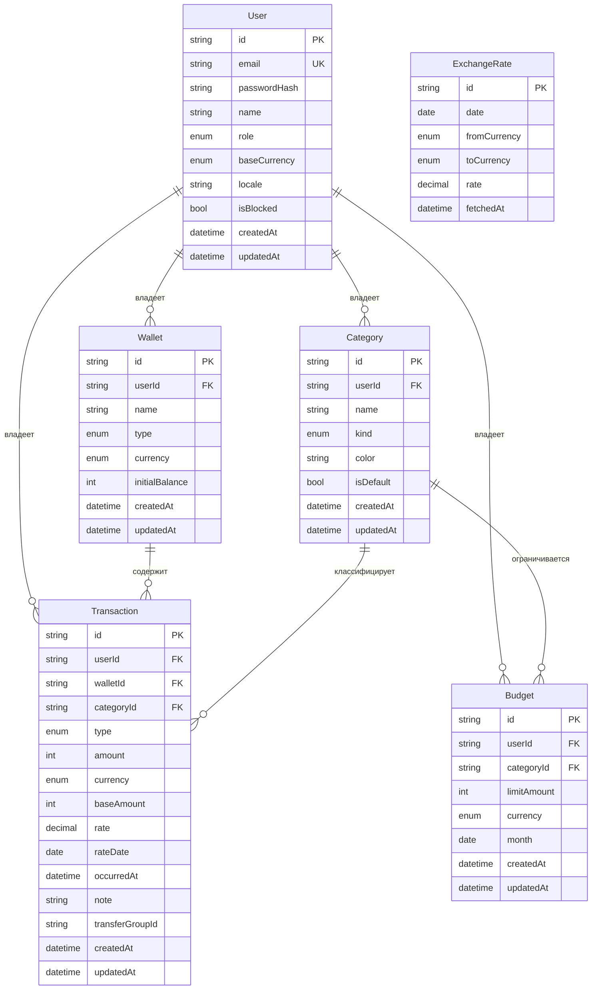

# Модель данных

**Проект:** finance-tracker
**СУБД:** PostgreSQL 16
**ORM:** Prisma

Документ описывает структуру базы данных до её реализации в `schema.prisma`.
Ссылки вида FR-x.y указывают на требования из `docs/spec.md`.

---

## 1. Сводка

| Сущность | Назначение |
|---|---|
| `User` | учётная запись, роль, валюта отчётности |
| `Wallet` | счёт: наличные, карта, накопительный |
| `Category` | классификатор операций |
| `Transaction` | движение средств по счёту |
| `Budget` | лимит расходов по категории за месяц |
| `ExchangeRate` | курс валюты на дату |

Шесть таблиц. Требование учебного плана — не менее четырёх.

---

## 2. Перечисления

```
Role            = USER | ADMIN
WalletType      = CASH | CARD | SAVINGS
CategoryKind    = INCOME | EXPENSE
TransactionType = INCOME | EXPENSE | TRANSFER_IN | TRANSFER_OUT
Currency        = BYN | USD | EUR
```

Перечисления реализуются как типы PostgreSQL, а не как строковые поля:
некорректное значение отсекается на уровне СУБД.

---

## 3. ER-диаграмма



`ExchangeRate` не связана внешними ключами: это справочник, привязка к нему
выполняется по дате и паре валют, а зафиксированное значение курса хранится
непосредственно в операции.

---

## 4. Описание таблиц

### 4.1. User

| Поле | Тип | Обяз. | По умолчанию | Примечания |
|---|---|:--:|---|---|
| `id` | `text` | да | `cuid()` | первичный ключ |
| `email` | `text` | да | — | уникален без учёта регистра |
| `passwordHash` | `text` | да | — | bcrypt, cost 12 (FR-1.2) |
| `name` | `varchar(80)` | да | — | отображаемое имя |
| `role` | `Role` | да | `USER` | FR-1.4 |
| `baseCurrency` | `Currency` | да | `BYN` | валюта отчётности (FR-7.2) |
| `locale` | `varchar(5)` | да | `ru` | язык интерфейса (NFR-3.1) |
| `isBlocked` | `boolean` | да | `false` | FR-1.8 |
| `createdAt` | `timestamptz` | да | `now()` | |
| `updatedAt` | `timestamptz` | да | авто | |

Ограничения: `UNIQUE(email)`, `UNIQUE(lower(email))`.

Регистронезависимость обеспечивает функциональный уникальный индекс
`CREATE UNIQUE INDEX ON "User" (lower("email"))`, добавляемый отдельной
миграцией. Обычный `UNIQUE(email)` при этом сохраняется: он не даёт
регистронезависимой гарантии, но нужен Prisma для `findUnique` по адресу.

Рассмотрен и отклонён вариант с типом `citext`: он требует расширения СУБД,
которое пришлось бы включать и на рабочей базе, тогда как функциональный
индекс работает на любом PostgreSQL. Приведение адреса к нижнему регистру
только в приложении отклонено — оно зависит от того, все ли пути записи
об этом помнят.

### 4.2. Wallet

| Поле | Тип | Обяз. | По умолчанию | Примечания |
|---|---|:--:|---|---|
| `id` | `text` | да | `cuid()` | |
| `userId` | `text` | да | — | → `User.id`, `ON DELETE CASCADE` |
| `name` | `varchar(60)` | да | — | |
| `type` | `WalletType` | да | — | FR-2.1 |
| `currency` | `Currency` | да | — | не изменяется после создания (FR-2.2) |
| `initialBalance` | `integer` | да | `0` | минорные единицы, может быть отрицательным |
| `createdAt` | `timestamptz` | да | `now()` | |
| `updatedAt` | `timestamptz` | да | авто | |

Ограничения: `UNIQUE(userId, name)` (FR-2.7).
Индексы: отдельный `INDEX(userId)` не создаётся — `userId` является ведущим
столбцом уникального индекса выше, и выборка счетов пользователя обслуживается
им же.

Текущий остаток в таблице **не хранится** (FR-2.5) — вычисляется агрегатом.

### 4.3. Category

| Поле | Тип | Обяз. | По умолчанию | Примечания |
|---|---|:--:|---|---|
| `id` | `text` | да | `cuid()` | |
| `userId` | `text` | да | — | → `User.id`, `ON DELETE CASCADE` |
| `name` | `varchar(40)` | да | — | |
| `kind` | `CategoryKind` | да | — | не изменяется после создания (FR-3.3) |
| `color` | `char(7)` | да | — | формат `#RRGGBB` |
| `isDefault` | `boolean` | да | `false` | создана при регистрации (FR-1.9) |
| `createdAt` | `timestamptz` | да | `now()` | |
| `updatedAt` | `timestamptz` | да | авто | |

Ограничения: `UNIQUE(userId, kind, name)` (FR-3.5).
Индексы: отдельный `INDEX(userId, kind)` не создаётся — эта пара является
префиксом уникального индекса выше.

### 4.4. Transaction

| Поле | Тип | Обяз. | По умолчанию | Примечания |
|---|---|:--:|---|---|
| `id` | `text` | да | `cuid()` | |
| `userId` | `text` | да | — | → `User.id`, `ON DELETE CASCADE` |
| `walletId` | `text` | да | — | → `Wallet.id`, `ON DELETE RESTRICT` |
| `categoryId` | `text` | нет | — | → `Category.id`, `ON DELETE RESTRICT`; `NULL` у переводов |
| `type` | `TransactionType` | да | — | |
| `amount` | `integer` | да | — | минорные единицы валюты счёта, строго > 0 |
| `currency` | `Currency` | да | — | копия валюты счёта |
| `baseAmount` | `integer` | да | — | минорные единицы валюты отчётности |
| `rate` | `numeric(18,8)` | да | — | применённый курс `currency` → валюта отчётности |
| `rateDate` | `date` | да | — | дата курса, фактически использованного |
| `occurredAt` | `timestamptz` | да | — | дата и время операции |
| `note` | `varchar(500)` | нет | — | FR-4.9 |
| `transferGroupId` | `uuid` | нет | — | связывает две записи перевода (FR-5.1) |
| `createdAt` | `timestamptz` | да | `now()` | |
| `updatedAt` | `timestamptz` | да | авто | |

Индексы:

```
INDEX(userId, occurredAt DESC)     -- основной список операций
INDEX(walletId, occurredAt)        -- расчёт остатка счёта
INDEX(categoryId, occurredAt)      -- агрегация по категориям, бюджеты
INDEX(transferGroupId)             -- удаление и просмотр перевода
```

Ограничения уровня СУБД (добавляются вручную в SQL-файл миграции — Prisma
не описывает `CHECK` в схеме):

```sql
ALTER TABLE "Transaction"
  ADD CONSTRAINT transaction_amount_positive CHECK ("amount" > 0),

  ADD CONSTRAINT transaction_rate_positive CHECK ("rate" > 0),

  ADD CONSTRAINT transaction_category_matches_type CHECK (
    ("type" IN ('INCOME','EXPENSE') AND "categoryId" IS NOT NULL)
    OR
    ("type" IN ('TRANSFER_IN','TRANSFER_OUT') AND "categoryId" IS NULL)
  ),

  ADD CONSTRAINT transaction_transfer_has_group CHECK (
    ("type" IN ('TRANSFER_IN','TRANSFER_OUT')) = ("transferGroupId" IS NOT NULL)
  );
```

Последние два ограничения важнее, чем кажутся: они делают невозможным
рассогласование между типом операции и её принадлежностью категории —
даже если ошибка проникнет в сервисный слой.

### 4.5. Budget

| Поле | Тип | Обяз. | По умолчанию | Примечания |
|---|---|:--:|---|---|
| `id` | `text` | да | `cuid()` | |
| `userId` | `text` | да | — | → `User.id`, `ON DELETE CASCADE` |
| `categoryId` | `text` | да | — | → `Category.id`, `ON DELETE CASCADE` |
| `limitAmount` | `integer` | да | — | минорные единицы, строго > 0 |
| `currency` | `Currency` | да | — | валюта отчётности; пересчитывается при её смене (FR-7.7) |
| `month` | `date` | да | — | первое число месяца |
| `createdAt` | `timestamptz` | да | `now()` | |
| `updatedAt` | `timestamptz` | да | авто | |

Ограничения: `UNIQUE(userId, categoryId, month)` (FR-6.2),
`CHECK (limitAmount > 0)`, `CHECK (EXTRACT(DAY FROM month) = 1)`.
Индексы: `INDEX(userId, month)`.

### 4.6. ExchangeRate

| Поле | Тип | Обяз. | По умолчанию | Примечания |
|---|---|:--:|---|---|
| `id` | `text` | да | `cuid()` | |
| `date` | `date` | да | — | дата действия курса |
| `fromCurrency` | `Currency` | да | — | |
| `toCurrency` | `Currency` | да | — | всегда `BYN` (см. 5.4) |
| `rate` | `numeric(18,8)` | да | — | 1 единица `from` = `rate` единиц `to` |
| `fetchedAt` | `timestamptz` | да | `now()` | момент загрузки |

Ограничения: `UNIQUE(date, fromCurrency, toCurrency)`, `CHECK (rate > 0)`,
`CHECK (toCurrency = 'BYN')` — правило раздела 5.4 обеспечивается СУБД,
а не только сервисным слоем.
Индексы: `INDEX(fromCurrency, toCurrency, date DESC)` — обслуживает поиск
ближайшего предшествующего курса (FR-7.5).

---

## 5. Проектные решения

### 5.1. Денежные величины — целое число минорных единиц

`amount`, `baseAmount` и `limitAmount` хранятся как `integer` в копейках
и центах. Вычисления с плавающей точкой над деньгами не выполняются
ни на одном этапе (NFR-2.3).

Предел типа `integer` — примерно 21 400 000 денежных единиц. Для личных
финансов запас избыточный. При необходимости тип меняется на `bigint`
одной миграцией.

`rate` — единственное поле типа `numeric`: курс не суммируется, а участвует
только в умножении с последующим округлением, поэтому точное десятичное
представление здесь уместно и безопасно.

### 5.2. Курс фиксируется в операции

`baseAmount`, `rate` и `rateDate` записываются в операцию при её создании
и не пересчитываются (FR-4.6, FR-7.6).

Причина: расход, совершённый в марте, не изменяется от того, что курс вырос
в августе. Альтернатива — вычислять сумму в валюте отчётности при каждом
запросе — даёт «плавающую» историю: одна и та же операция показывает разные
суммы в разные дни, а месячные итоги меняются задним числом.

`rateDate` хранится отдельно от `occurredAt`, потому что при отсутствии курса
на дату операции применяется ближайший предшествующий (FR-7.5). Без этого поля
невозможно объяснить, откуда взялось значение `rate`.

Пересчёт при смене валюты отчётности (FR-7.7) — единственная операция,
изменяющая `baseAmount` и `rate` у существующих записей. Выполняется пакетно
в одной транзакции.

Правило пересчёта одно для всех записей: каждая берётся по курсу своей даты,
а не по текущему. Для операции это её `rateDate`, для бюджета — первое число
его месяца; у бюджета пересчитываются `limitAmount` и `currency`. Если курса
на какую-то из требуемых дат нет вовсе, транзакция откатывается целиком
и валюта отчётности не меняется (`RATE_NOT_AVAILABLE`).

### 5.3. `userId` продублирован в `Transaction`

Формально владелец операции выводится через `Wallet.userId`, и поле избыточно.
Оно добавлено сознательно, по двум причинам:

1. **Проверка прав.** Каждый сервис первым делом проверяет принадлежность
   ресурса пользователю (NFR-1.1). С прямым полем это условие в запросе;
   без него — обязательное соединение с `Wallet` в каждом запросе, которое
   легко забыть, а цена ошибки — доступ к чужим данным.
2. **Производительность списков.** Основной запрос — «операции пользователя
   за период» — обслуживается одним индексом `(userId, occurredAt DESC)`
   без соединений.

Риск избыточности — рассогласование при смене владельца счёта. Смена владельца
в системе не предусмотрена, поэтому риск не реализуется.

### 5.4. Курсы хранятся только относительно BYN

Национальный банк публикует курсы иностранных валют к белорусскому рублю.
Хранятся пары `USD → BYN` и `EUR → BYN`; кросс-курс `USD → EUR` вычисляется
через BYN в сервисном слое.

Это исключает рассогласование: при хранении всех шести направлений возможна
ситуация, когда `USD → EUR` и `EUR → USD` не обратны друг другу.

### 5.5. Перевод — две записи с общей группой

Перевод не выделен в отдельную таблицу. Он представлен парой записей
`TRANSFER_OUT` и `TRANSFER_IN` с общим `transferGroupId` (FR-5.1).

Обоснование: перевод — это два реальных движения по двум счетам. При отдельной
таблице расчёт остатка счёта потребовал бы объединения двух источников,
а это самый частый запрос в системе.

Обе записи создаются в одной транзакции базы данных (FR-5.2, NFR-2.1).
Категория у них отсутствует, поэтому переводы автоматически выпадают
из статистики доходов и расходов (FR-5.6): агрегаты фильтруются
по `type IN ('INCOME','EXPENSE')`.

При различии валют `amount` каждой записи выражен в валюте своего счёта,
а фактический курс операции равен отношению сумм (FR-5.4).

### 5.6. Политики удаления

| Связь | Политика | Обоснование |
|---|---|---|
| `User` → всё | `CASCADE` | удаление учётной записи удаляет все её данные |
| `Wallet` → `Transaction` | `RESTRICT` | счёт с историей не удаляется (FR-2.4) |
| `Category` → `Transaction` | `RESTRICT` | категория со связанными операциями не удаляется (FR-3.4) |
| `Category` → `Budget` | `CASCADE` | бюджет без категории лишён смысла |

`RESTRICT` выбран вместо мягкого удаления сознательно: мягкое удаление
добавляет условие «не удалён» в каждый запрос системы, и одно забытое условие
даёт неверные итоги. Явная ошибка с указанием количества связанных записей
понятнее пользователю, чем исчезнувшая история.

### 5.7. Период бюджета

Период задан полем `month` типа `date`, всегда указывающим на первое число.
Ограничение `UNIQUE(userId, categoryId, month)` напрямую выражает требование
FR-6.2.

Вариант с парой `periodStart` / `periodEnd` рассмотрен и отклонён: он допускает
пересекающиеся периоды, которые невозможно запретить ограничением уникальности,
и потребовал бы проверки пересечений в приложении. Произвольные периоды
в требованиях отсутствуют.

### 5.8. Остаток счёта — агрегат, а не поле

Остаток нигде не хранится (FR-2.5). В валюте счёта он равен:

```
initialBalance
  + сумма amount по type IN ('INCOME', 'TRANSFER_IN')
  − сумма amount по type IN ('EXPENSE', 'TRANSFER_OUT')
```

`amount` всегда строго положителен (FR-4.2) — знак движения задаёт `type`,
а не само число. Запрос обслуживается индексом `(walletId, occurredAt)`.

Причина отказа от хранимого поля: денормализованный остаток расходится
с операциями при каждой правке, удалении и откате транзакции, причём
расходится молча. Агрегат таким свойством не обладает — он и есть
определение остатка.

Остаток в валюте отчётности (`baseBalance` в FR-2.6, общий остаток
в FR-8.1) вычисляется конвертацией **всего остатка по курсу на текущую
дату**, а не суммированием `baseAmount` операций. Причины две:

1. у `initialBalance` нет ни зафиксированного курса, ни даты — складывать
   его с суммой `baseAmount` попросту не из чего;
2. остаток отвечает на вопрос «сколько денег есть сейчас», и правильный
   ответ на него даёт только текущий курс.

Противоречия с FR-7.6 здесь нет. Запрет на пересчёт по текущему курсу
относится к историческим операциям и к итогам за период: они по-прежнему
считаются суммированием зафиксированных `baseAmount` и задним числом
не меняются. Остаток историей не является — он относится к «сегодня».

Если курса на текущую дату ещё нет, применяется ближайший предшествующий
(FR-7.5).

---

## 6. Контрольные сценарии

Проверка модели на трёх нетривиальных случаях.

**Перевод 100 USD с карточного счёта на рублёвый при курсе 3.25.**
Создаются две записи с общим `transferGroupId`: `TRANSFER_OUT`,
`amount = 10000`, `currency = USD`; `TRANSFER_IN`, `amount = 32500`,
`currency = BYN`. Обе с `categoryId = NULL`, обе в одной транзакции БД.
Остатки обоих счетов пересчитываются агрегатом. В статистику доходов
и расходов записи не попадают.

**Удаление категории «Продукты», по которой есть 340 операций.**
`ON DELETE RESTRICT` отклоняет удаление на уровне СУБД. Сервис перехватывает
ошибку и возвращает код `CATEGORY_HAS_TRANSACTIONS` с числом связанных
записей. Клиент показывает сообщение согласно локали (FR-11.5).

**Операция за 1 января, когда курса на эту дату нет.**
Запрос ищет ближайший предшествующий курс по индексу
`(fromCurrency, toCurrency, date DESC)`. Найденное значение записывается
в `rate`, его дата — в `rateDate`. Если предшествующего курса нет вовсе,
операция отклоняется кодом `RATE_NOT_AVAILABLE` (FR-7.5).

---

## 7. Наполнение при регистрации

Категории по умолчанию (FR-1.9), `isDefault = true`:

**Расходы:** продукты, транспорт, жильё, кафе и рестораны, здоровье, одежда,
развлечения, связь и интернет, образование, прочее.

**Доходы:** зарплата, подработка, подарки, прочее.

Цвета назначаются из фиксированного набора, согласованного
с `docs/design-system.md`.

---

## 8. Демонстрационные данные

Сценарий наполнения (NFR-5.4) создаёт:

- две учётные записи: `admin@demo.local` с ролью `ADMIN`
  и `user@demo.local` с ролью `USER`;
- для пользователя — три счёта: наличные в BYN, карта в BYN,
  накопительный в USD;
- операции за последние 12 месяцев: 15–40 записей в месяц, суммы и категории
  распределены неравномерно, чтобы аналитика выглядела осмысленно;
- 4–6 переводов между счетами, включая межвалютные;
- бюджеты по четырём категориям на текущий месяц, один из них — превышенный;
- курсы валют за весь период истории.

Сценарий идемпотентен: повторный запуск очищает данные и создаёт их заново.
